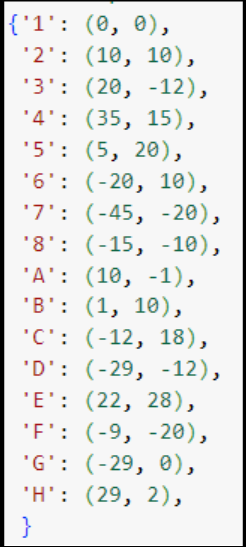
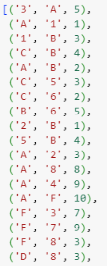
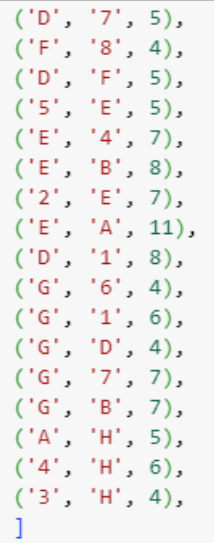
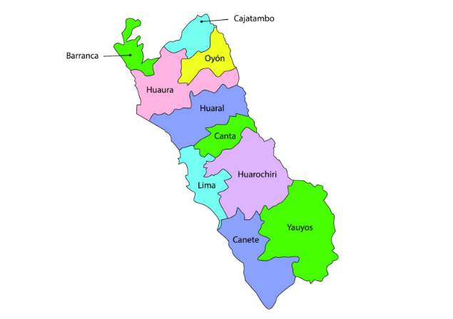

    <strong>Universidad Peruana de Ciencias Aplicadas</strong> 
    </img> 
    <strong>Ingeniería de Software - 2024-1</strong> 
    <strong>Complejidad Algorítmica - WX72</strong> 
     INFORME DE TRABAJO PARCIAL - PRIMER HITO 

    <h3>Team Members:</h3>
    <table align="center">
        <tr>
            <th style="text-align:center;">Member</th>
            <th style="text-align:center;">Code</th>
        </tr>
        <tr>
            <td>Alvarez Araguache, Samira Jetzabel</td>
            <td>U20211A046</td>
        </tr>
        <tr>
            <td>Daiki Oscar Oshiro Yamashita</td>
            <td>U20201F846</td>
        </tr>
        <tr>
            <td>Zagaceta Bardales, Rodrigo Enrique</td>
            <td>U202215489</td>
        </tr>
    </table>

    <strong>Abril, 2024</strong>

 

## [1. Descripción del problema](#1-descripción-del-problema-1)
## [2. Descripción y visualización del conjunto de datos (Dataset)](#2-descripción-y-visualización-del-conjunto-de-datos-dataset-1)
- [2.1. Descripción del conjunto de datos](#21-descripción-del-conjunto-de-datos)
- [2.2. Visualización del conjunto de datos](#22-visualización-del-conjunto-de-datos)
## [3. Propuesta](#3-propuesta-1)
## [4. Bibliografía](#4-bibliografía-1)
## [5. Anexos](#5-anexos-1)

# 1. Descripción del problema

El problema que abordaremos se centra en la gestión eficiente del tiempo de entrega de productos entre los almacenes de una empresa ubicada en Lima. La empresa busca minimizar el tiempo requerido para entregar los productos entre sus diferentes ubicaciones, teniendo en cuenta las limitaciones de la infraestructura vial y las condiciones variables del tráfico en la ciudad.

Según el Plan de Desarrollo Urbano de Lima Metropolitana al 2035, publicado por la Municipalidad Metropolitana de Lima, se estima que la congestión del tráfico en Lima causa pérdidas económicas significativas, que ascienden a aproximadamente el 3% del PIB de la ciudad. Estas pérdidas incluyen costos asociados con el tiempo perdido en el tráfico, el aumento del consumo de combustible y los impactos negativos en la productividad de las empresas debido a retrasos en la entrega de productos.

La gestión del tiempo de entrega implica encontrar las rutas más eficientes para transportar los productos entre los almacenes, considerando la distancia, las condiciones del tráfico en tiempo real y las características de la red vial de Lima.

Objetivos a lograr:

- Diseñar un sistema de gestión del tiempo de entrega que minimice los tiempos de transporte entre los almacenes de la empresa en Lima, Perú.
- Maximizar la eficiencia en la distribución de productos, asegurando entregas rápidas y consistentes en todo momento.

# 2. Descripción y visualización del conjunto de datos (Dataset)
Mediante el uso de una base de datos en la que se encuentre la ubicación detallada de cada uno de los elementos en el almacén. Obtendremos los datos de la latitud, longitud y número de local o almacén en el que se ubican los objetos. Los datos recolectados son en total de 1500 intersecciones en todos los almacenes.
## 2.1. Descripción del conjunto de datos
Los siguientes datos presentes en el cuadro 1, son los usados para la creación de nuestro mapa del inventario. El primer punto es el identificador del nodo o ID_Nodo, los números son las tiendas ubicadas en la ciudad y las letras los lugares para recoger los materiales para llevarlos a las tiendas, el segundo carácter es la latitud y por último la longitud del grafo. En cuanto al cuadro 2, el cuál está relacionado con las distancias de las aristas entre los nodos del grafo, el primer y segundo carácter están relacionados con los nodos y el último carácter es la distancia presente entre ambos. Todos estos datos están relacionados con la ciudad de Canta.

- Cuadro 1:
  
</img>

- Cuadro 2:

</img>

</img>

## 2.2. Visualización del conjunto de datos
Visualizamos un mapa de toda Lima, imágen 1, el cuál sería la área en la que estará disponible nuestro servicio de búsqueda avanzada para encontrar el mejor camino posible para la gestión de inventarios. En base a nuestros datos, se representa el grafo obtenido según su longitud y latitud asignados a cada uno de los nodos generados. A modo de ejemplo en la imágen 2 se colocó un grafo de una parte de Lima en específico que es en Canta.

- Imagen 1:

</img>

- Imagen 2:

</img>

# 3. Propuesta
El propósito principal de este proyecto es crear un sistema que permita reducir los tiempos de transporte entre los almacenes de una empresa con sede en Lima, Perú. Este sistema busca maximizar la eficiencia en la reposición de productos y reducir los tiempos de entrega. Esto contribuirá a mejorar la rentabilidad y la sostenibilidad económica de la empresa a largo plazo, así como mejorar la experiencia del cliente.

**Técnicas y metodología**

Para lograr estos objetivos, se utilizará el algoritmo de Dijkstra, el cual permite encontrar la ruta más corta con el uso de grafos ponderados. El algoritmo determinará dicha ruta desde un nodo de partida hasta los demás nodos del grafo, siguiendo el camino en las aristas de menor peso. La eficacia de Dijkstra en este tipo de casos ha sido demostrada en investigaciones previas con resultados positivos. Por ejemplo, en el estudio de Curo (2016), evidenció mejoras significativas en la reducción del tiempo y la distancia de la distribución de productos entre secciones de un mismo almacén. Además, Ortiz (2019), logró una reducción del 65.07% en el tiempo de respuesta del serenazgo de la zona de Abancay, Apurimac, al estimar la ruta más corta a recorrer por parte de los serenos para atender el llamado de un ciudadano.

La metodología a seguir para este proyecto iniciará con la recopilación y generación de las posibles rutas en la ciudad de Lima, así como la ubicación de los almacenes en el mapa, las distancias entre ellos y la división por zonas para facilitar la implementación del algoritmo. Luego, se procederá a modelar el grafo, donde los nodos representarán los almacenes de la empresa y las aristas las rutas entre ellos, mientras que los pesos representarán las distancias entre los vértices. Una vez realizado esto, se pasará a implementar el algoritmo de Dijkstra, segmentado por zonas, lo que nos permitirá encontrar las rutas más cortas entre los almacenes, optimizando así el tiempo de despacho de los productos.

# 4. Bibliografía

Ortiz, B. (2019). *Sistema de red de seguridad basada en el algoritmo de Dijkstra para reducir el tiempo de respuesta ante casos de inseguridad ciudadana en Abancay, 2017*. [Tesis de licenciatura, Universidad Nacional Micaela Bastidas de Apurímac] https://repositorio.unamba.edu.pe/bitstream/handle/UNAMBA/767/T_0478.pdf?sequence=1&isAllowed=y 

Curo, F. (2016). *Sistema para la distribución de productos dentro de un almacén de materia prima con el algoritmo Dijkstra alternativo*. [Tesis de licenciatura, Universidad Cesar Vallejo]. https://repositorio.ucv.edu.pe/bitstream/handle/20.500.12692/101819/Curo_HFW-SD.pdf?sequence=4&isAllowed=y 

# 5. Anexos

Link de acceso al repositorio: https://github.com/ComplejAlgorit/primerhito-tp
